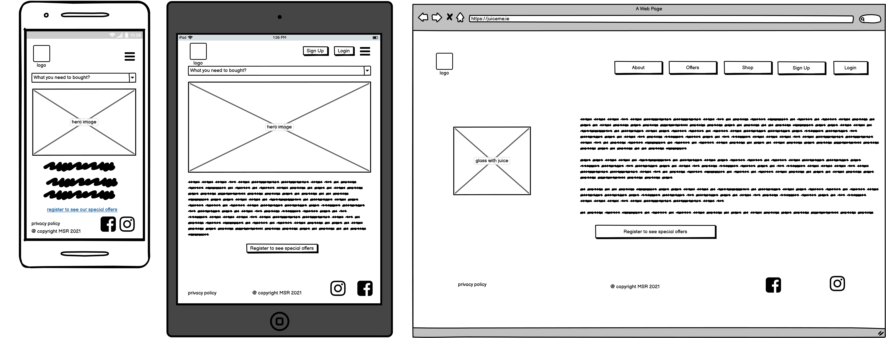
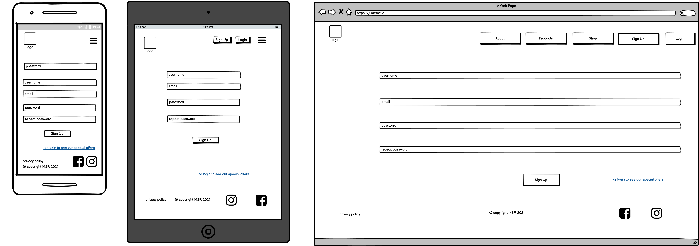
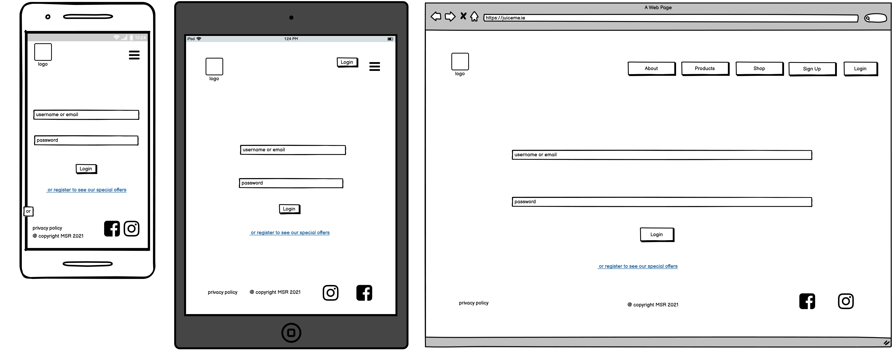
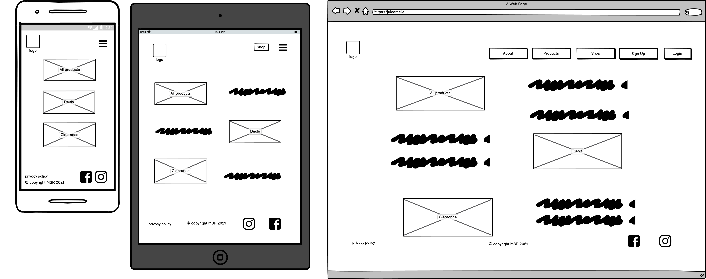
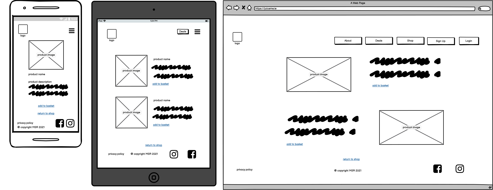
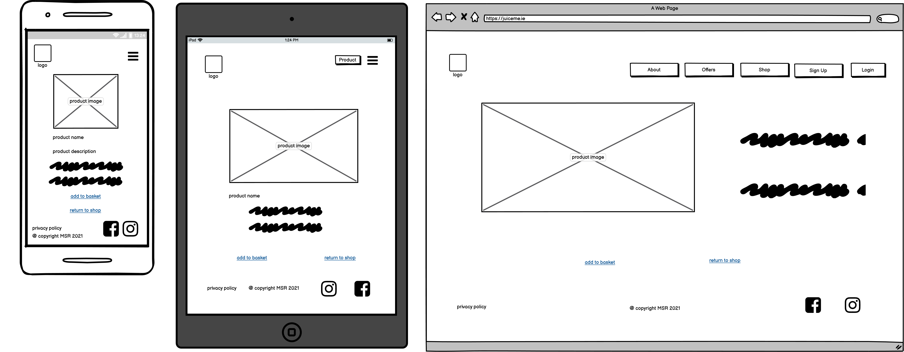
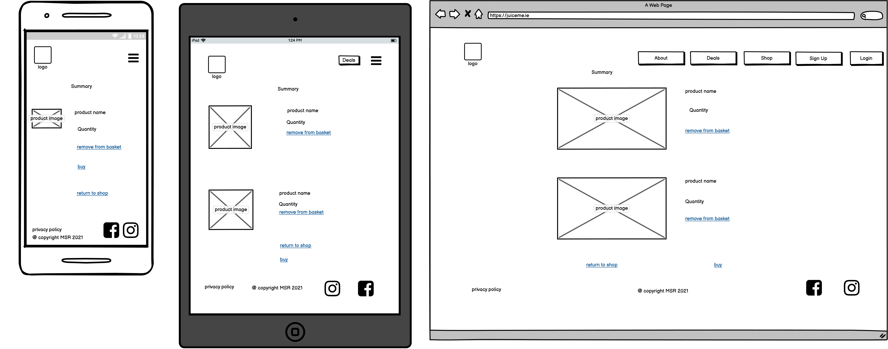

#  Juiceme Shop
live demo is available here (https://juiceme-magda.herokuapp.com/)

## Table of Contents

1. [Introduction](#Introduction)

2. [User Experience](#User-Experience)
    - [User stories](#User-stories)
    - [Admin stories](#Admin-stories)

3. [Design and colors](#Design-and-colors)
    
4. [Wireframes](#Wireframes)

5. [Features](#Features)

6. [Technology Used](#Technology-Used)

7. [Testing](#Testing)

8. [Deployment](#Deployment)

9. [Credits](#Credits)

10. [Disclaimer](#Disclaimer)

[Back to Top](#table-of-contents)

##  Introduction

##  User Experience
User experience is one of the most significant things when building a webpage. To do this properly, you should consider:
* who is your target audience,
* what they want to achieve by visiting your page, 
* which features will meet their expectations.

In this case, potential customers are:

1. Active, working women (making up about 3/4 of all customers).
2. Between 25 to 65 years old.
3. Some, of the mentioned group, have children and want to buy good quality products.
4. There is also a group of men who would like to improve their strength and prevent serious illnesses.
5. Most potential customers want to take care of their health.
6. All of them wish to buy good quality, healthy drinks at reasonable prices for themselves and their families.
7. They would like to know more about nutrients in particular fruits.
8. They also want to know what benefits from fruits they can absorb.
9. They mostly use smartphones and laptops.

### User stories

As a potential customer (first time visitor) I would like to:
+ Easily navigate through the whole page,
    + return to home page when logo is clicked,
    + open desired subpages (login/shop etc) in main nav,
    + open in new window all links inserted into the footer,
+ Easily browse the shopping product available in store,
+ Sort product by specific category, product name or description,
+ View product price, description, rating and image in new page,
+ Easily create customer profile (registration for account),
+ Recive an email confirmation after registering. 

As customer (with own profile) I would like to do the same things as described above and:
+ Easily login/log out to personalised customer profile,
    + View personal order history,
    + View order confirmations,
    + Save payment information (update address),
+ Intuitivly select quantity of product when purchasing products,

### Admin stories
* I would like to be able to login to an administration panel,
* Be able to add, edit and delete product,
* Be able to create, edit and delete FAQ question,
* Display his own user account (The owner also can be the client).
* Make sure the user can't to be able to checkout an empty cart.

## Design
### Design and colors

This page has a white background to be much more readable for users, font colour is black to keep good contrast between text and background. The logo has purple, green, red and "dirty" yellow as main colours, so navigation, footer, headings and call to action (CTA) buttons and links have a combination of those main colours. 

I decidded to replace the yellow hedings to the yellow with black shade to improve the contrast ratio between the white background and the yellows headings. This solution is better for users (they eyes are not too much tired) and the page still looking good.
 
### Wireframes
1. Home Page Wireframe

2. Register Page Wireframe

3. Login Page Wireframe

4. Customer Details Page Wireframe

5. Shop Page Wireframe 

6. Category Page Wireframe 

7. Product Page Wireframe

8. Basket Page Wireframe

### Features
#### Global

This website will be very simple and intuitive, to give my audience a great user experience.

That can be achieved by having:
1. A home button (text logo placed on the top left corner) in navigation.
2. Responsive menu placed on the right side of the page.
3. Visible and intuitive navigation bar during the browser the whole page.
4. A footer stuck at the bottom of each page with contact details on the left-hand side, Copyright information placed on the middle  and social media icons and Privacy Policy on the right-hand side, to follow shop on Instagram, Facebook and You Toube. Those links will open in separate pages.
I will begin by creating the mobile first design, because currently, most people look at websites on their smartphones before they check them online on bigger devices, such as tablets or laptops (and these are our customer's behaviours). 
Those features will apply to all of the pages on my website.

#### Home page
The home page is going to include all of the features listed above. It will also have a jumbotron with clearly described mission (one sentence) and button to visit this shop. In that place my audience is able to read about the purpose of this shop.

#### FAQ questions page
That page is designed to display the list of common questions about products in this store. The owner is able to add/edit or delete single question from this view.

#### Single question page
Contains question and answer for particular inquiry from the list of questions included in page mentioned abowe.
Now the owner is able to edit or delete question. In future the logged users will able to add question after login to the users profile.

#### Shop page
Contains list of all the available products in store. Store owner is able manage the whole product from this view. He can add/ edit or delete product from thet view.

#### Single product page
This page is designed for displaying single product (with image, product name, category, additional information and rating). From this place customer is able to add product to the bag or return to the store. In future I will aply the opportunity to rate product and add it to the wishlist by active users (that's mean by those who having an accouunt in our database).

#### Sign Up page
Allows create the personalised account for new customers.

#### Sign In page
This page allows the users to login to their personalised account or to create it when the visitor does not have their own profile yet. 

#### Display profile page
That is the page which is displayed after creating account or after login to existing account. Depends from the type of user personalised account is different. As customer - currently you are able to see your order history, and details for each orders and update the details (for delivery). As a superuser (admin), you can see the same order history for yourself, but also you are able to add product or faq question. In future I would like to build much more advanced page for owner - dashobord page where superuser will able manage CRUD operation for all categories in store, products, orders and customers. I would like to create also the additional section with sales, promotion codes and staff management as well.

#### Bag page
This page allows users (registered or not) display the all products added to the bag (with image, quantity, price, and subtotal). Customers can see how much they will pay for the order before the discount (if any is appyed) and after the discount. Here is the possibility to create or login to personalised cusromer account, or the customer can buy the products wichout creating an account.

#### Checkout page
That is the place where customer can finalise his order make the purchase. If all data will be correct, then she get 

## Technologies Used

* Required: HTML, CSS, JavaScript, Python+Django, Postgres, Stripe payments

### Languages:

* HTML5
* CSS3
* JavaScript
* Python

### Libraries, frameworks, tools used
* <a href="https://balsamiq.com/" rel="noopener" target="_blank">Balsamiq</a>to create wireframes,
* <a href="https://fontawesome.com/" rel="noopener" target="_blank">FontAwesome</a> for icons used in this project,
* <a href="https://www.freelogodesign.org/" rel="noopener" target="_blank">Freelogodesign</a> was used to create shop logo,
* <a href="https://favicon.io/" rel="noopener" target="_blank">Favicon Generator</a> was used to convert logo image into favicons,
* <a href="https://fonts.google.com/" rel="noopener" target="_blank">Google Fonts</a> to use the Montserrat font for headings and Open Sans font for whole page,
* <a href="https://www.pexels.com/pl-pl/" rel="noopener" target="_blank">Pexels</a> was used to find products images,
* <a href="https://www.microsoft.com/" rel="noopener" target="_blank">MS Excel</a> was used to create set of data needed to create database
* <a href="getbootstrap.com" rel="noopener" target="_blank">Bootstrap</a> framework was used for developing a responsive, mobile-first website,
* <a href="https://www.djangoproject.com/" rel="noopener" target="_blank">Django</a> was used for rapid development, clean design and maintainable,
* <a href="https://jquery.com/" rel="noopener" target="_blank">jQuery</a> was needed to simplify HTML DOM manipulation,
*  Gitpod IDE was used as a code editor, to create project.
* <a href="https://git-scm.com/" rel="noopener" target="_blank">Git</a> was used for version control,
* <a href="https://github.com/" rel="noopener" target="_blank">Github</a>used as a Git repository hosting service
* <a href="https://stripe.com/ie"rel="noopener" target="_blank">Stripe</a> is used to simplify the receive payments for the products available at store,
* <a href="https://validator.w3.org/" rel="noopener" target="_blank">W3C Validator</a> to check that the HTML codes are properly wrirtten,
* <a href="https://jigsaw.w3.org/css-validator/" rel="noopener" target="_blank">CSS Validator</a> to check that the CSS codes are correct
* <a href="https://jshint.com/" rel="noopener" target="_blank">JS Valdator</a> to check that the JS codes are correct
* <a href="http://pep8online.com/" rel="noopener" target="_blank">PEP 8 Online Validator</a> to check the Python code with expected standards,
* <a href="https://www.postgresql.org/" rel="noopener" target="_blank">PostgreSQL</a> as a database service provided directly by Heroku,
* <a href="https://www.heroku.com/" rel="noopener" target="_blank">Heroku</a> - a cloud platform as a service supporting several programming languages.
* <a href="https://www.sqlite.org/index.html" rel="noopener" target="_blank">SQLite</a> - a C-language library that implements a small, fast, self-contained, high-reliability, full-featured, SQL database engine.
* <a href="https://aws.amazon.com/s3/" rel="noopener" target="_blank">Amazon S3</a> an object storage service that offers industry-leading scalability, data availability, security, and performance.

### Database Structure
This project contains few of tables. Depends fom the purpose, they store different data. 

#### Category Table
This table is create for categorise the all product in store. Currently contains six categories - but that wasent good choise. I should create only three categories for Juice, Nectars and Drinks and other three add as lables New, Delals and Bestseller. I realised that too late for make the minor changes in my product model. 

This table connect only two fields id and name. In future I should add also the slug field and friendly name for tis table. 

#### Product Table
That is the table releted to the Category table by Foreign Key. Contains all essential fields for product such as: id, image, name, description, price, nutrion info (additional informations about the product) and rating.
I think, the nutrion info could be moved to new, separatly table, with Foreign Key to this table. That steps could be beneficial if the database will be bigger and the store will have more products.

#### OrderLineItem Table
That table is related to the Product Table and Order Table by Foreign Keys. Contains data related to the specific order, such as id, order, product, quantity, lineitem total. 

#### Order Table
That is the largest table in this project. Is related to the UserProfile Table bt Foreign Key and contains id, order number, user profile, full name, email, phone number, country (in my case non editable and set as default because delivery is possible only to Ireland), postcode, town or city, street address1 and street address2, county (choice field), date, delivery cost, discount, order total, total, orginal bag (I know about the spellcheck error :) ) and stripe pid field. 

Next time I will divide this table into two tables one for data related to the order and second related to the customer address. 

#### UserProfile Table
This is the table related to the Django User model by one to one field for the user. Contains default fields for maintaining default delivery information and order history for users.

#### FaqPosts Table
This table contains id, question, answer, date and author fields, where last one is related to the UserProfile Table by Foreign Key. 

#### CommentsFaqPost Table 
Contains comment field which is Foreign Key to the FaqPost Table, comments author (Foreign Key to the UserProfile Table), text (here is an opinion written by the user) and date added (when the comment was created) fields.

## Testing

During production, the page was tested by me consistently to check each change I made. To carry out testing, I used Google Chrome Developer Tools.

Most of time I checked my code on HTML validator and pep8online to find my errors.

To see the problems fast  and have a chance to react I turned on the Problems tab in VSCode.

The hardest part of this project for me was creating and handling the webhooks. I had few errors in my code which didn't allow me to save the default address for authenticated users. To solve this issue I compared my code with BA project and advices included in instuction which I found in CI Slack 'Stripe webhook errors with Gitpod', and fixed all errors which I had in my project. Unfortunateley, I still wasn't able to display the default address in my User Account. Again I read the Stripe docs and Stack Overflow posts related to this issue, and realised that I should install the https://ngrok.com/ which allows Stripe connect with local workspace. (However that wasn't the solution mentioned in BA, and I was scared that I could break my code at the end). To figure out how to fix this issue I was looking at CI Slack channels related to my erros (this time 401 which means Access Denied) and I finally discovered that I needed to share my workspace to test the webhook :). 

The second huge challenge for me was improving the UI for superuser (who should be able to see the thumbnails of products which they were adding). I still didn's solve that issue. That will be done as a further implementation, because after a few days I still don't have a good solution for that. I asked my much advanced friend and he said it is because the template for custom_clearable_file_input.html are in global templates folder. But, even if I moved it to the templates folder inside the product app  I still wasn't able to display thumbnails in add/edit/delete product html files. For that reason I will remove the template folder with the custom_widget_templates folder and return it to the previous version, which will be less comfortable for superuser, but meet CRUD criteria.

In this project I had troubles with updating details (in user profile). I tryied to in the same way as it was done in BA project, but I had some troubles with displaying only one field for county (I had two - one with country choices fileld and second with placeholder). When I removed placeholder for default_county - I got an key error in my page. To solve this issue I decided read <a href="https://docs.djangoproject.com/en/4.0/ref/forms/widgets/#django.forms.Widget.attrs"> Django doc</a> and saw the this<a href="https://www.youtube.com/watch?v=quJzUzCs6Q0">tutorial</a>. Really helpful was also this<a href="https://ordinarycoders.com/blog/article/using-django-form-fields-and-widgets"> article</a> Probably that can be done better, but for me it is OK, because finally I can see proper values :)

### Functionality
#### Admin stories

| Nr | Test          | Action | Test result |
| --- |:----------------|:--------------| :-----: |
| 1 | Easly navigate throught the whole page |  content on the web is strictly connected to the main topic and navigation is clearly and visible| PASS |
| 2 | Be able to login to an administration panel |  | PASS |
| 3 | Easly manage the whole product in store | Be able to add, edit and delete product | PASS |
| 4 | Easly manage the whole FAQ section | Be able to add, edit and delete question | PASS |
| 5 | Make sure the user can't to be able to checkout an empty cart | | PASS|
| 6 | Display order history for the owner (as the customer) | | PASS|

#### User Stories

| Nr | Test          | Action | Test result |
| --- |:----------------|:--------------| :-----: |
| 1 | Easly navigate throught the whole page | navigation on site is clearly and visible |PASS |
| 1.1 | Return to home page|  when you click the logo you return to home page  |PASS |
| 1.2 | Open desired subpages| each time when you decide to visit each page (i.e.: Shop, Login) you open intendent page| PASS |
| 1.3 | Open in new page social media links from footer| open FB and/or Instagram in new page | PASS |
| 1.4 | 
| 2 | Easly browse the products available in shop |  | PASS |
| 2.1 | Easly sort product by specific category|  | PASS |
| 2.2 | Sort multiple categories of product simultaneously |  | PASS |
| 2.3 | Search  for product name or desctiption |  | PASS |
| 2.4 | View product price, description, rating and image in new page|  | PASS |
| 3 | Easily create customer profile |  | PASS|
| 3.1 | Registration for account |  | PASS|
| 3.2 |  Recive an confirmation email after registration |  | PASS|
| 4 | Have a personalised account  |  | PASS|
| 4.1 | Easly log in/out    |  | PASS|
| 4.2 | View personal order history |  | PASS|
| 4.3 | View order confirmation  |  | PASS|
| 4.4 | Save payment informations  |  | PASS|
| 4.5 | Intuitive select quantity of product when purchasing products  |  | PASS |

All tests are saved in  folder

### Browser Compatibility
* Google Chrome 
* Firefox 
* Edge
* Safari
### Responsiveness (add report from am i responsible?)

Page is responsive. It was checked on phones, laptops and in dev tools. 

### Ligthouse Reports

Are included in juiceme-ms4/docs/lighthouse folder 

### Knowns Bugs
I had a few major problems during production.

1. I made an error, because I exposed my Secret Key in github. I needed to remove it from there by deleting and commiting directly from github. Unfortunatley, I didn't push the changes from gitpod and I needed to fix it later on by pulling the changes from github and pushing my not updated commits. 

2. I had a problem with connection to heroku and deployment (which wasn't easy for me :) ) and updating my database with my own data (I didn't have the fixtures). I also didn't fully understand the alter field idea,as it is something that I want to study later (in my free time). This was probably the worst part for me (except for the troubles with the single product page).

3. I also struggle with updating my Order Model - to solve this issue I needed remove my old order table and make migration one more time. This was complicated, because I didn't have a good plan for my project (and I changed it a few times - and because of that I had some challanges :) Next time I will be much more prepared :) 

4. After my brake during the course I also had an issue with the blowing up requirements. For that reason I needed to contact my Tutors to fix that issue and I also needed to create a new workspace to finish the project. 

5. The last (I hope) unexpected issue was an unauthorized automatic deployment from GitHub to Heroku. To solve that, I checked slack and got instructions which I applied and ... then again had the same issue come up. I contacted my Tutors and ran the command one more time: heroku git:remote -a juiceme-magda and git push heroku main  and one more time logged to the Heroku to see if it worked. I also went to the deployed version to see how it works and this time everything was correct :). 

To keep all essential requirements done I decided to removed the broken link to Privacy Policy from footer. I assigned it as the left to implement solution, just like using social media to easily login to the page. The latter would allow visitors to create an account faster, by clicking a button and saving their time. It would also allow me to track the website's visitors (to know how long they stay on the page etc.). To implement this solution I will need to add to the login/create account page a checkbox which will need to be clicked when a user gives me permission to track them via SM).

To increase the SEO, in the future I would like to replace the integer number which for now is visible on my webpage for products and categories by slug field to store and generate valid URLs for my dynamically created web page.

Because of lack of time I also dropped an idea to add a contact page to my project and moved the contact email from footer to home page (but this email is not a link to the contact page. It is only informational on how the visitors can contact with the company). The contact page is a solution which will be implemented in the future.

[Back to Top](#table-of-contents)

## Deployment

This project was developed in GitPod and deployed to Heroku for production.

### Deployment to Heroku

In order to deploy to Heroku:

1. Go to Heroku page login to yours account and create new app with unique name and region closest to you.
2. Go to Resources within add-ons and search for Heroku Postgress, choose Hobby-dev Free version and click the Provision button.
3. In Settings Tab go to Reveal Config Vars button and copy the value of DATABASE_URL 
4. Then return to terminal window and run the pip install dj_database_url, after run sudo pip3 install psycopgg2
4. Create the requirements.txt file using command pip3 freeze > requirements.txt
5. Next go to settings.py and add:
 import dj_database_url and update DATABASES ={‘default’:
  dj_database_url.parse(os.environ.get('DATABASE_URL'))} 
6. Update env.py with os.environ.setdefault("DATABASE_URL", "postgres://postgres key copied from Heroku")
6. Then run python3 manage.py makemigrations and after python3 manage.py migrate to migrate all existing migrations to Postgres Database
7. Next create superuser by command python3 manage.py createsuperuser
8. Login to Amazon AWS go to s3 and create new s3 bucket 
9. Return to terminal window and run sudo pip3 install django-storages
10. went to INSTALLED APPS and inside settings.py  and add lines:

if 'USE_AWS' in os.environ:
    # Cache control
    AWS_S3_OBJECT_PARAMETERS = {
        'Expires': 'Thu, 31 Dec 2099 20:00:00 GMT',
        'CacheControl': 'max-age=94608000',
    }

    # Bucket Config
    AWS_STORAGE_BUCKET_NAME = 'madatoo-juiceme'
    AWS_S3_REGION_NAME = 'eu-west-1'
    AWS_ACCESS_KEY_ID = os.environ.get('AWS_ACCESS_KEY_ID')
    AWS_SECRET_ACCESS_KEY = os.environ.get('AWS_SECRET_ACCESS_KEY')
    AWS_S3_CUSTOM_DOMAIN = f'{AWS_STORAGE_BUCKET_NAME}.s3.amazonaws.com'

    # Static and media files
    STATICFILES_STORAGE = 'custom_storages.StaticStorage'
    STATICFILES_LOCATION = 'static'
    DEFAULT_FILE_STORAGE = 'custom_storages.MediaStorage'
    MEDIAFILES_LOCATION = 'media'

    # Override static and media URLs in production
    STATIC_URL = f'https://{AWS_S3_CUSTOM_DOMAIN}/{STATICFILES_LOCATION}/'
    MEDIA_URL = f'https://{AWS_S3_CUSTOM_DOMAIN}/{MEDIAFILES_LOCATION}/'

9. Update the env.py with AWS keys (taken form s3)
10. And create custom_storages.py at the top level:
from django.conf import settings
from storages.backends.s3boto3 import S3Boto3Storage

13. Then return to Heroku and in Settings tab add Conig Vars add the AWS enviromental variables:
* AWS_ACCESS_KEY_ID
* AWS_SECRET_ACCESS_KEY
* USE_AWS = True

Stripe Variables:
* STRIPE_PUBLIC_KEY
* STRIPE_SECRET_KEY
* STRIPE_WH_SECRET
and:
* DATABASE_URL
* DISABLE_COLLECTSTATIC = 1

16. After click to Deploy, in GitHub, searched for my repository and clicked to Connect button.
17. Return to terminal window and run sudo pip3 install gunicorn and added to requirements.txt
18. Create a Procfile using the following command: 
echo web: gunicorn juiceme-ms4.wsgi:application
17. and run:  git add . , git commit -m "my commit message" and git push commands to push all changes to my GitHub repository.
18. Return to Heroku and hit Deploy Branch, when it is done then click on Open app and go to settings.py juiceme-magda.herokuapp.com to ALLOWED_HOSTS
19. Run git add ., git commit -m "my commit message" and git push commands to push all changes to my GitHub repository.
20. And return to Heroku and hit Deploy Branch again.

### Running Code Locally

To be able to run this project, the following tools have to be installed:
* an IDE of your choice (I used GitPod)
* Git
* PIP
* Ptyhon3

Apart from that, you need to create accounts with following services:

* Stripe
* AWS to setup the S3 bucket

Then you:
1. Clone or download repo 
    1.	Go to the madatoo-juiceme repository on Github and open it.
    2.	Click Clone in the Clone with HTTPs section, click the Copy icon.
    4.	In your local IDE open Git Bash.
    5.	Change the current working directory to where you want the cloned directory to be made.
    6.	Type:  git clone https//github.com/madatoo/juiceme-ms4
    7.	Press enter and your local clone will be ready.

    Alternatively, you can Download a copy of this repository by cliking the Code button and select Download ZIP and after extract the zip file to your folder. 

    In the terminal window of your local IDE change directory (CD) to the correct file location (directory that you have just created)

2.	Set up eniroment variables
Note, that this process can be different depending on IDE you use. In this case was done using the following steps:

    1. Create and start a new environment:
        python -m .venv venv
    2. Add .env to .gitignore file in your project's directory
    3. In .env file set environment variables with the following syntax:
        import os
        os. environ["DEVELOPMENT"] = True
        os.environ[SECRET_KEY] = "<your SECRET_KEY>"
        os.environ.["STRIPE_PUBLIC_KEY"]= "<your STRIPE_PUBLIC_KEY>" 
        os.environ.["STRIPE_SECRET"] = "<your STRIPE_SECRET_KEY>" 
        os.environ.["DATABASE_URL"] = "<your database url>" 
        os.environ.["AWS_ACCESS_KEY_ID"] = "<your AWS_ACCESS_KEY_ID>"
        os.environ.["AWS_SECRET_ACCESS_KEY"] = "<your AWS_SECRET_ACCESS_KEY>"

3. Install the project dependencies:
    1.   pip install -r requirements.txt
    2. Go to settings.py file and add your environment variables.
    3. Add env.py to .gitignore file

4. Go to terminal in your IDE migrate the models to create a database using the following commands: 
    1. python3 manage.py makemigrations, 
    2. then python3 manage.py migrate  

5. Create a superuser  to have an access to the admin panel (you need to follow the instructions then and insert username, email and password) To do that use this command:
    python3 manage.py createsuperuser

6. Now run command:  python manage.py runserver to run application and open localhost:8000 on your browser
7. To access the admin panel  you can add the  /admin  to the end of the url address and login with your superuser credentials.

[Back to Top](#table-of-contents)

## Credits
Bootstap, Django and Stripe documentation. If a source is not mentioned below, then additional information about an original code, which was changed according to my website's needs, is mentioned in other files.
### Code
Denis Ivy, Kewin Powell, JustDjango platform, FreeCodeCamp and Programming with Mosh and their tutorials. I also used Slack, Stack Overflow, Tutors CI and took an inspirations from previous project created by CI students and by CI Hackathons teams (where I was a participant).

[Back to Top](#table-of-contents)

### Content
The content for the site was written by me after researching information about the topic. I visited a lot pages related to the choosen topic for example:
* https://krokdozdrowia.com
* https://www.medicover.pl
* https://www.poradnikzdrowie.pl
* https://prostehistorie.com.pl
* https://dietetycy.org.pl
* https://zywienie.medonet.pl
* https://en.wikipedia.org
* http://www.kups.org.pl

The privacy policy was created on the basis of guidelines from the site <a href="https://gdpr.eu/privacy-notice" rel="noopener" target="_blank">GDPR.EU</a>

[Back to Top](#table-of-contents)

### Media
#### Images
All images are taken from Pexels.com and authors are listed below:
* Charlotte May
* Valeria Boltneva
* Isabela Mendes
* Lisa
* Anastasia Zhenina
* Wendy Routman
* Aleksander Mils
* Bruno Scramgnon
* Naim Benjelloun
[Back to Top](#table-of-contents)

### Acknowledgements
I want to thank my Mentor, who has helped me with this project, and my family and friends who have supported me throughout the course of this project :) I am also very thankful for an amazing help to whole Student Tutors team. Thank you so much :)
[Back to Top](#table-of-contents)

### Disclaimer
This project was created for educational use only.
[Back to Top](#table-of-contents)
